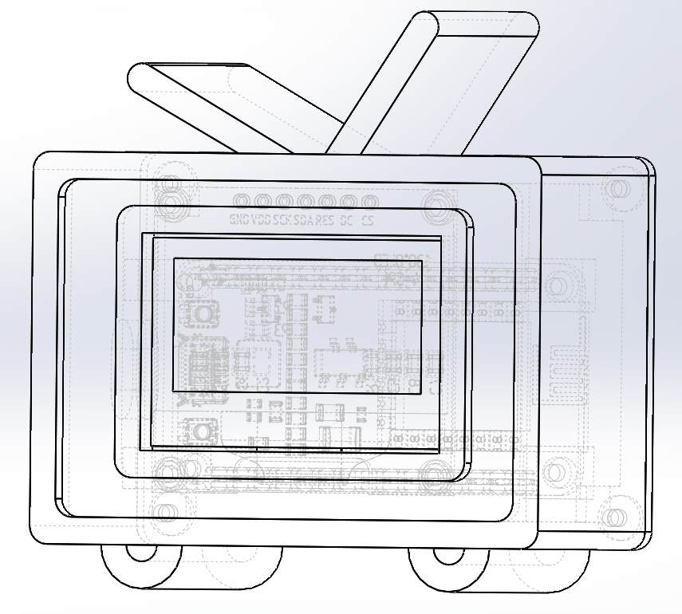

# SubsMonitor 粉丝数小电视
<!-- PROJECT LOGO -->

  
  <h3 align="center">SubsMonitor 粉丝数小电视</h3>

<!-- TABLE OF CONTENTS -->

  
Table of Contents

  <ol>
    <li>
      <a href="#about-the-project">About The Project</a>
      <ul>
        <li><a href="#built-with">Built With</a></li>
      </ul>
    </li>
    <li>
      <a href="#getting-started">Getting Started</a>
      <ul>
        <li><a href="#prerequisites">Prerequisites</a></li>
        <li><a href="#installation">Installation</a></li>
        <li><a href="#usage">Usage</a></li>
      </ul>
    </li>
  </ol>

<!-- ABOUT THE PROJECT -->

## About The Project
Wants to keep monitor number of your subscribers of Bilibili? This project is to build a Bilibili Icon-like small device to update the number of fans of a Bilibili user, 24x7 non-stop. It grep the information via WiFi connection, after the first configuration. A reconnect message displays on the screen when connection is lost. Use any device to configure the device again and it's will be ready to update again.

### Built With

To build this device, you should have following hardwares:

- ESP8266 (Here I use a NodeMCU)
- SSD1306 (OLED display, I2C or SPI)
- A qualified USB cable (some cable does not have data transmission)

Software:

- Windows 10
- [Visual Studio Code](https://code.visualstudio.com/) ([PlatformIO](https://platformio.org/)) or [Arduino IDE](https://www.arduino.cc/en/software/)

<!-- GETTING STARTED -->

## Getting Started

This is an example of how you may give instructions on setting up your project locally.

### Prerequisites

- First, make sure your computer can identify the device correctly, ensure your computer has the corresponding USB driver of the device.

* Open Visual Studio Code and open the folder of the program
* Make sure the PlatformIO is correctly loaded

### Installation

1. Now the Bilibili UID and Bilibili User's name are hardcoded, change it to yours first
2. Connect OLED and ESP8266 as comment shown in the code
3. Connect ESP8266 to Computer via USB
4. Use the PlatformIO flashing tool to build and burn program into ESP8266

<!-- USAGE EXAMPLES -->

## Usage

1. The device will start a WiFi hotspot named "SubMonitor", Connect to this WiFi
2. Once the WiFi is connected, your device will be automatically redirect to a Configuration Page
3. To let the device connect to the Internet, put the WiFi SSID and password into the Configuration Page, and Click <kbd>submit</kbd>
4. The device will start to connect to the WiFi you indicated.
5. The device will start to show and update number of subscribers
6. Reconnection is required if disconnection exceed particular period, you can defind the TIMEOUT on your own
